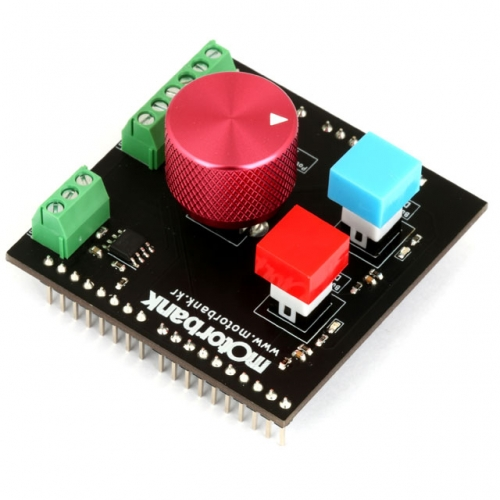
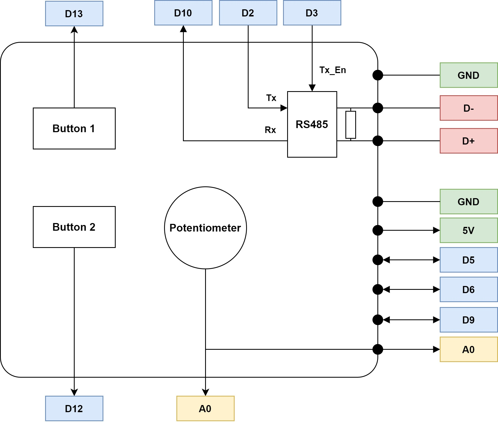

## MAS-001 (Motorbank Arduino Shield 001)

<a href="https://www.motorbank.kr/goods/goods_view.php?goodsNo=1000009835">구매하러 가기</a>

### Description
MAS-001은 다양한 모터 드라이버를 손쉽게 아두이노로 제어할 수 있도록 해주는 중계 기판입니다. 또한 아두이노에서 RS-485 통신을 할 수 있게 확장해 주어, 기존 아두이노에서는 제어할 수 없었던 고성능 드라이버들을 제어할 수 있게 해 줍니다. 모터뱅크에서는 MAS-001과 함께 다양한 샘플 코드를 제공하여 사용자가 빠르게 시스템에 접목시킬 수 있도록 하였습니다.

### How To Start
:star2: <a href="https://github.com/Motorbank/MAS001/wiki/%EB%9D%BC%EC%9D%B4%EB%B8%8C%EB%9F%AC%EB%A6%AC-%EC%84%A4%EC%B9%98%ED%95%98%EA%B8%B0">시작 안내서 바로가기</a> :star2:

### Support Drivers
MAS-001을 통해 제어할 수 있는 드라이버는 다음과 같습니다. 각 드라이버에 대한 아두이노 쉴드 사용 방법은 **examples 폴더의 해당 예제 파일** 을 참고하시기 바랍니다.

| 예제파일 |  지원 드라이버 |
|-----------|:----------------------:|
| [**SBD-10**](./examples/SBD-10)    | [SBD-10][1], [SBD-11][2], [MSD-221][3] |
| [**BLC-150**](./examples/BLC-150)   | [BLC-150][4], [BLB-160][8] |
| [**BLC-200**](./examples/BLC-200)   | [BLC-200][5], [BLC-400R4E][6], [DMC-200][9] |
| [**DMD-150**](./examples/DMD-150) | [DMD-150][7] |
| [**SBD-14**](./examples/SBD-14) | [SBD-14][10] |
| [**BDD-240**](./examples/BDD-240) | [BDD-240][11], [BDD-480][12] |

[1]:https://www.motorbank.kr/goods/goods_view.php?goodsNo=1000007838
[2]:https://www.motorbank.kr/goods/goods_view.php?goodsNo=1000009130
[3]:https://www.motorbank.kr/goods/goods_view.php?goodsNo=1000009593
[4]:https://www.motorbank.kr/goods/goods_view.php?goodsNo=1000009113
[5]:https://www.motorbank.kr/goods/goods_view.php?goodsNo=1000007964
[6]:https://www.motorbank.kr/goods/goods_view.php?goodsNo=1000009836
[7]:https://www.motorbank.kr/goods/goods_view.php?goodsNo=1000009128
[8]:https://www.motorbank.kr/goods/goods_view.php?goodsNo=1000009614
[9]:https://www.motorbank.kr/goods/goods_view.php?goodsNo=1000008040
[10]:https://www.motorbank.kr/goods/goods_view.php?goodsNo=1000010044
[11]:https://www.motorbank.kr/goods/goods_view.php?goodsNo=1000011688
[12]:https://www.motorbank.kr/goods/goods_view.php?goodsNo=1000011806

### Block Diagram

