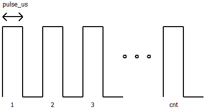

# API Document

```c
void init();
```
* **description** : 스텝 모터를 제어하기 위한 초기화를 진행합니다. 반드시 setup() 과정에서 호출되어야 합니다.

```c
void enable(uint8_t value);
```
* **description** : 드라이버의 EN 핀을 제어합니다.
* **arguments** :
  * value : HIGH / LOW

```c
void direction(uint8_t value);
```
* **description** : 드라이버의 DIR 핀을 제어합니다.
* **arguments** :
  * value : HIGH / LOW

```c
void continuousPulse(uint16_t pulse_us);
```
* **description** : STP 핀으로 일정 폭의 펄스를 지속적으로 발생시킵니다.
* **arguments** :
  * pulse_us : 펄스의 폭을 microsecond 단위로 설정합니다. (0 ~ 16383)


```c
void burstPulse(uint16_t pulse_us, uint32_t cnt = 0);
```
* **description** : STP 핀으로 특정 폭의 펄스를 특정 값 만큼 발생시킵니다.
* **arguments** :
  * pulse_us : 펄스의 폭을 microsecond 단위로 설정합니다. (0 ~ 16383)
  * cnt : 발생시킬 펄스 갯수. (0 ~ 65535)


